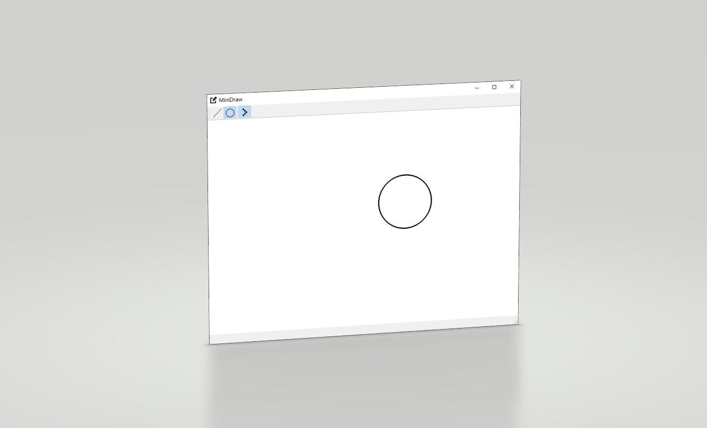

# Bresenham with antialiasing

A simple Qt application to show Bresenham Algorithm in drawing lines and circles, with optional anti-aliasing mode.

## Illustration

## Environment

- Qt Version: Desktop Qt 5.12.9 MSVC2017 64bit. 

Other Qt versions and platforms are supposed to be compilable.

## Usage

A x64 release is uploaded to this repository, try it free.

To access source code, open `./minidraw/minidraw.pro` with Qt Creator.

## Shortcut Keys

- L——Line
- C——Circle
- A——Anti-Aliasing

## References

- [Bresenham快速画直线算法-枫叶落一地-博客园](https://www.cnblogs.com/pheye/archive/2010/08/14/1799803.html)
- [Bresenham画圆法（计算机图形学）-时光足迹-CSDN博客](https://blog.csdn.net/gaoxiaoba/article/details/52154852)

